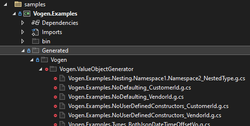

| Name           | Operating System      | Status                                                                              | History                                                                                                                                                                            |
|:---------------|:----------------------|:------------------------------------------------------------------------------------|:-----------------------------------------------------------------------------------------------------------------------------------------------------------------------------------|
| GitHub Actions | Ubuntu, Mac & Windows |  | [](https://github.com/SteveDunn/Vogen/actions) |

 [](https://GitHub.com/stevedunn/vogen/releases/) [](https://github.com/SteveDunn/Vogen/blob/main/LICENSE) 
[](https://GitHub.com/stevedunn/vogen/issues/) [](https://GitHub.com/stevedunn/vogen/issues?q=is%3Aissue+is%3Aclosed) 
[](https://www.nuget.org/packages/Vogen/)

<p align="center">
  
</p>

[](https://stars.medv.io/stevedunn/vogen)
## Give a Star! :star:
If you like or are using this project please give it a star. Thanks!

# Vogen: cure your Primitive Obsession

Vogen is a .NET Source Generator and analyzer. It turns your primitives (ints, decimals etc.) into Value Objects that 
represent domain concepts (CustomerId, AccountBalance etc.)

It adds new C# compilation errors to help stop the creation of invalid Value Objects. 

## Overview

The source generator generates strongly typed **domain concepts**. You provide this:

```csharp
[ValueObject]
public partial struct CustomerId {
}
```

... and Vogen generates source similar to this:

```csharp
    public partial struct CustomerId : System.IEquatable<CustomerId>, System.IComparable<CustomerId>, System.IComparable {
        private readonly int _value;

        public readonly int Value => _value;

        public CustomerId() {
            throw new Vogen.ValueObjectValidationException("Validation skipped by attempting to use the default constructor...");
        }

        private CustomerId(int value) => _value = value;

        public static CustomerId From(int value) {
            CustomerId instance = new CustomerId(value);
            return instance;
        }

        public readonly bool Equals(CustomerId other) ...
        public readonly bool Equals(int primitive) ...
        public readonly override bool Equals(object obj) ...
        public static bool operator ==(CustomerId left, CustomerId right) ...
        public static bool operator !=(CustomerId left, CustomerId right) ...
        public static bool operator ==(CustomerId left, int right) ...
        public static bool operator !=(CustomerId left, int right) ...
        public static bool operator ==(int left, CustomerId right) ...
        public static bool operator !=(int left, CustomerId right) ...

        public readonly override int GetHashCode() ...

        public readonly override string ToString() ...
    }
```

You then use `CustomerId` instead of `int` in your domain in the full knowledge that it is valid and safe to use:

```csharp
CustomerId customerId = CustomerId.From(123);
SendInvoice(customerId);
...

public void SendInvoice(CustomerId customerId) { ... }
```

`int` is the default type for Value Objects, but you can, individually, or globally, 
configure them to be other types. See the Configuration section later in the document, but here's some brief examples:

```csharp
[ValueObject<decimal>] // C# 11 generic attributes
public partial struct AccountBalance { }

[ValueObject(typeof(string))]
public partial class LegalEntityName { }
```

The main goal of Vogen is to **ensure the validity of your Value Objects**, the code analyser helps you to avoid mistakes which 
might leave you with uninitialized Value Objects in your domain.

It does this by **adding new constraints in the form of new C# compilation errors**. There are a few ways you could end up
with uninitialized Value Objects. One way is by giving your type constructors. Providing your own constructors
could mean that you forget to set a value, so **Vogen doesn't allow you to have user defined constructors**:

```csharp
[ValueObject]
public partial struct CustomerId {
    // Vogen deliberately generates this so that you can't create your own:
    // error CS0111: Type 'CustomerId' already defines a member called 'CustomerId' with the same parameter type
    public CustomerId() { }

    // error VOG008: Cannot have user defined constructors, please use the From method for creation.
    public CustomerId(int value) { }
}
```

In addition, Vogen will spot issues when **creating** or **consuming** Value Objects:

```csharp
// catches object creation expressions
var c = new CustomerId(); // error VOG010: Type 'CustomerId' cannot be constructed with 'new' as it is prohibited
CustomerId c = default; // error VOG009: Type 'CustomerId' cannot be constructed with default as it is prohibited.

var c = default(CustomerId); // error VOG009: Type 'CustomerId' cannot be constructed with default as it is prohibited.
var c = GetCustomerId(); // error VOG010: Type 'CustomerId' cannot be constructed with 'new' as it is prohibited

var c = Activator.CreateInstance<CustomerId>(); // error VOG025: Type 'CustomerId' cannot be constructed via Reflection as it is prohibited.
var c = Activator.CreateInstance(typeof(CustomerId)); // error VOG025: Type 'MyVo' cannot be constructed via Reflection as it is prohibited

// catches lambda expressions
Func<CustomerId> f = () => default; // error VOG009: Type 'CustomerId' cannot be constructed with default as it is prohibited.

// catches method / local function return expressions
CustomerId GetCustomerId() => default; // error VOG009: Type 'CustomerId' cannot be constructed with default as it is prohibited.
CustomerId GetCustomerId() => new CustomerId(); // error VOG010: Type 'CustomerId' cannot be constructed with 'new' as it is prohibited
CustomerId GetCustomerId() => new(); // error VOG010: Type 'CustomerId' cannot be constructed with 'new' as it is prohibited

// catches argument / parameter expressions
Task<CustomerId> t = Task.FromResult<CustomerId>(new()); // error VOG010: Type 'CustomerId' cannot be constructed with 'new' as it is prohibited

void Process(CustomerId customerId = default) { } // error VOG009: Type 'CustomerId' cannot be constructed with default as it is prohibited.
```

One of the main goals of this project is to achieve **almost the same speed and memory performance as using primitives directly**.
Put another way, if your `decimal` primitive represents an Account Balance, then there is **extremely** low overhead of 
using an `AccountBalance` Value Object instead. Please see the [performance metrics below](#Performance). 

___

## Installation

Vogen is a [Nuget package](https://www.nuget.org/packages/Vogen). Install it with:

`dotnet add package Vogen`

When added to your project, the **source generator** generates the wrappers for your primitives and and the **code analyser**
will let you know if you try to create invalid Value Objects.

## Usage

Think about your _domain concepts_ and how you use primitives to represent them, e.g. instead of this:

```csharp
public void HandlePayment(int customerId, int accountId, decimal paymentAmount)
```

... have this:

```csharp
public void HandlePayment(CustomerId customerId, AccountId accountId, PaymentAmount paymentAmount)
```


It's as simple as creating types like this:

```csharp
[ValueObject] 
public partial struct CustomerId { }

[ValueObject] 
public partial struct AccountId { }

[ValueObject<decimal>] 
public partial struct PaymentAmount { }
```


## More on Primitive Obsession
The source generator generates [Value Objects](https://wiki.c2.com/?ValueObject). Value Objects help combat Primitive Obsession by wrapping simple primitives such as `int`, `string`, `double` etc. in a strongly-typed type.

Primitive Obsession (AKA StringlyTyped) means being obsessed with primitives.  It is a Code Smell that degrades the quality of software.

> "*Primitive Obsession is using primitive data types to represent domain ideas*" [#](https://wiki.c2.com/?PrimitiveObsession)

Some examples:

* instead of `int age` - we'd have `Age age`. `Age` might have validation that it couldn't be negative
* instead of `string postcode` - we'd have `Postcode postcode`. `Postcode` might have validation on the format of the text

The source generator is opinionated. The opinions help ensure consistency. The opinions are:

* A Value Object (VO) is constructed via a factory method named `From`, e.g. `Age.From(12)`
* A VO is equatable (`Age.From(12) == Age.From(12)`)
* A VO, if validated, is validated with a static method named `Validate` that returns a `Validation` result
* Any validation that is not `Validation.Ok` results in a `ValueObjectValidationException` being thrown

It is common to represent domain ideas as primitives, but primitives might not be able to fully describe the domain idea.  
To use Value Objects instead of primitives, we simply swap code like this:

```csharp
public class CustomerInfo {
    private int _id;
    public CustomerInfo(int id) => _id = id;
}
```

.. to this:

```csharp
public class CustomerInfo {
    private CustomerId _id;
    public CustomerInfo(CustomerId id) => _id = id;
}
```
## Tell me more about the Code Smell

There's a blog post [here](https://dunnhq.com/posts/2021/primitive-obsession/) that describes it, but to summarise:

> Primitive Obsession is being *obsessed* with the *seemingly* **convenient** way that primitives, such as `ints` and `strings`, allow us to represent domain objects and ideas.

It is **this**:

```csharp
int customerId = 42
```

What's wrong with that?

A customer ID likely cannot be *fully* represented by an `int`.  An `int` can be negative or zero, but it's unlikely a customer ID can be. So, we have **constraints** on a customer ID.  We can't _represent_ or _enforce_ those constraints on an `int`.

So, we need some validation to ensure the **constraints** of a customer ID are met. Because it's in `int`, we can't be sure if it's been checked beforehand, so we need to check it every time we use it.  Because it's a primitive, someone might've changed the value, so even if we're 100% sure we've checked it before, it still might need checking again.

So far, we've used as an example, a customer ID of value `42`.  In C#, it may come as no surprise that "`42 == 42`" (*I haven't checked that in JavaScript!*).  But, in our **domain**, should `42` always equal `42`?  Probably not if you're comparing a Supplier ID of `42` to a Customer ID of `42`! But primitives won't help you here (remember, `42 == 42`!).

```csharp
(42 == 42) // true
(SuppliedId.From(42) == SupplierId.From(42)) // true
(SuppliedId.From(42) == VendorId.From(42)) // compilation error
```

But sometimes, we need to denote that a Value Object isn't valid or has not been set. We don't want anyone _outside_ of the object doing this as it could be used accidentally.  It's common to have `Unspecified` instances, e.g.

```csharp
public class Person {
    public Age Age { get; } = Age.Unspecified;
}
```

We can do that with an `Instance` attribute:

```csharp
  [ValueObject]
  [Instance("Unspecified", -1)]
  public readonly partial struct Age {
      public static Validation Validate(int value) =>
          value > 0 ? Validation.Ok : Validation.Invalid("Must be greater than zero.");
  }
```

This generates `public static Age Unspecified = new Age(-1);`.  The constructor is `private`, so only this type can (deliberately) create _invalid_ instances.

Now, when we use `Age`, our validation becomes clearer:

```csharp
public void Process(Person person) {
    if(person.Age == Age.Unspecified) {
        // age not specified.
    }
}
```

We can also specify other instance properties:

```csharp
[ValueObject(typeof(float))]
[Instance("Freezing", 0)]
[Instance("Boiling", 100)]
public readonly partial struct Celsius {
    public static Validation Validate(float value) =>
        value >= -273 ? Validation.Ok : Validation.Invalid("Cannot be colder than absolute zero");
}
```

## Configuration

Each Value Object can have it's own *optional* configuration. Configuration includes:

* The underlying type
* Any 'conversions' (Dapper, System.Text.Json, Newtonsoft.Json, etc.) - see [the Integrations page](https://github.com/SteveDunn/Vogen/wiki/Integration) in the wiki for more information
* The type of the exception that is thrown when validation fails

If any of those above are not specified, then global configuration is inferred. It looks like this:

```csharp
[assembly: VogenDefaults(underlyingType: typeof(int), conversions: Conversions.Default, throws: typeof(ValueObjectValidationException))]
```

Those again are optional. If they're not specified, then they are defaulted to:

* Underlying type = `typeof(int)`
* Conversions = `Conversions.Default` (`TypeConverter` and `System.Text.Json`)
* Validation exception type = `typeof(ValueObjectValidationException)`

There are several code analysis warnings for invalid configuration, including:

* when you specify an exception that does not derive from `System.Exception`
* when your exception does not have 1 public constructor that takes an int
* when the combination of conversions does not match an entry

## Performance

(to run these yourself: `dotnet run -c Release -- --job short --framework net6.0 --filter *` in the `benchmarks` folders)

As mentioned previously, the goal of Vogen is to achieve very similar performance compare to using primitives themselves.
Here's a benchmark comparing the use of a validated Value Object with underlying type of int vs using an int natively (*primitively* 🤓)

``` ini
BenchmarkDotNet=v0.12.1, OS=Windows 10.0.22000
AMD Ryzen 9 5950X, 1 CPU, 32 logical and 16 physical cores
.NET Core SDK=6.0.100
  [Host]   : .NET Core 5.0.12 (CoreCLR 5.0.1221.52207, CoreFX 5.0.1221.52207), X64 RyuJIT
  ShortRun : .NET Core 5.0.12 (CoreCLR 5.0.1221.52207, CoreFX 5.0.1221.52207), X64 RyuJIT

Job=ShortRun  IterationCount=3  LaunchCount=1  
WarmupCount=3  

```

| Method                 |     Mean |    Error |   StdDev | Ratio | Allocated |
|------------------------|---------:|---------:|---------:|------:|----------:|
| UsingIntNatively       | 13.57 ns | 0.086 ns | 0.005 ns |  1.00 |         - |
| UsingValueObjectStruct | 14.08 ns | 1.131 ns | 0.062 ns |  1.04 |         - |

There is no discernible difference between using a native int and a VO struct; both are pretty much the same in terms of speed and memory.

The next most common scenario is using a VO class to represent a native `String`.  These results are:

``` ini
BenchmarkDotNet=v0.12.1, OS=Windows 10.0.22000
AMD Ryzen 9 5950X, 1 CPU, 32 logical and 16 physical cores
.NET Core SDK=6.0.100
  [Host]   : .NET Core 5.0.12 (CoreCLR 5.0.1221.52207, CoreFX 5.0.1221.52207), X64 RyuJIT
  ShortRun : .NET Core 5.0.12 (CoreCLR 5.0.1221.52207, CoreFX 5.0.1221.52207), X64 RyuJIT

Job=ShortRun  IterationCount=3  LaunchCount=1  
WarmupCount=3  

```

| Method                   |     Mean |    Error |  StdDev | Ratio | RatioSD |  Gen 0 | Allocated |
|--------------------------|---------:|---------:|--------:|------:|--------:|-------:|----------:|
| UsingStringNatively      | 135.4 ns | 16.89 ns | 0.93 ns |  1.00 |    0.00 | 0.0153 |     256 B |
| UsingValueObjectAsStruct | 171.8 ns | 14.40 ns | 0.79 ns |  1.27 |    0.01 | 0.0153 |     256 B |

There is a tiny amount of performance overhead, but these measurements are incredibly small. There is no memory overhead.

## Serialisation and type conversion

By default, each VO is decorated with a `TypeConverter` and `System.Text.Json` (STJ) serializer. There are other converters/serializer for:

* Newtonsoft.Json (NSJ)
* Dapper
* EFCore
* [LINQ to DB](https://github.com/linq2db/linq2db)

They are controlled by the `Conversions` enum. The following has serializers for NSJ and STJ:

```csharp
[ValueObject(conversions: Conversions.NewtonsoftJson | Conversions.SystemTextJson, underlyingType: typeof(float))]
public readonly partial struct Celsius { }
```

If you don't want any conversions, then specify `Conversions.None`.

If you want your own conversion, then again specify none, and implement them yourself, just like any other type.  But be aware that even serializers will get the same compilation errors for `new` and `default` when trying to create VOs.

If you want to use Dapper, remember to register it - something like this:

```csharp
SqlMapper.AddTypeHandler(new Customer.DapperTypeHandler());
```

See the examples folder for more information.

## FAQ

### Is there a Wiki for this project?

Yes, it's here: https://github.com/SteveDunn/Vogen/wiki


### What versions of .NET are supported?

The source generator is .NET Standard 2.0. The code it generates supports all C# language versions from 6.0 and onwards 

If you're using the generator in a .NET Framework project and using the old style projects (the one before the 'SDK style' projects), then you'll need to do a few things differently:

* add the reference using `PackageReference` in the .csproj file:

```xml
  <ItemGroup>
      <PackageReference Include="Vogen" Version="[LATEST_VERSION_HERE - E.G. 1.0.18]" PrivateAssets="all" />
  </ItemGroup>
```

* set the language version to `latest` (or anything `8` or more):

```diff
  <PropertyGroup>
+    <LangVersion>latest</LangVersion>
    <Configuration Condition=" '$(Configuration)' == '' ">Debug</Configuration>

```

### Does it support C# 11 features?
This is primarily a source generator. The source it generates is mostly C# 6 for compatibility. But if you use features from a later language version, for instance `records` from C# 9, then it will also generate records.

Source generation is driven by attributes, and, if you're using .NET 7 or above, the generic version of the `ValueObject` attribute is exposed:

```csharp
[ValueObject<int>]
public partial struct Age { }
```

### Why are they called 'Value Objects'?

The term Value Object represents a small object who's equality is based on value and not identity. From [Wikipedia](https://en.wikipedia.org/wiki/Value_object)

> _In computer science, a Value Object is a small object that represents a simple entity whose equality is not based on identity: i.e. two Value Objects are equal when they have the same value, not necessarily being the same object._

In DDD, a Value Object is (again, from [Wikipedia](https://en.wikipedia.org/wiki/Domain-driven_design#Building_blocks))

>  _... a Value Object is an immutable object that contains attributes but has no conceptual identity_

### How can I view the code that is generated?

Add this to your `.csproj` file:

```xml
<PropertyGroup>
    <EmitCompilerGeneratedFiles>true</EmitCompilerGeneratedFiles>
    <CompilerGeneratedFilesOutputPath>Generated</CompilerGeneratedFilesOutputPath>
</PropertyGroup>

<ItemGroup>
    <Compile Remove="Generated/*/**/*.cs" />
</ItemGroup>
```

Then, you can view the generated files in the `Generated` folder. In Visual Studio, you need to select 'Show all files' in the Solution Explorer window:


Here's an example from the included `Samples` project:



### Why can't I just use `public record struct CustomerId(int Value);`?

That doesn't give you validation. To validate `Value`, you can't use the shorthand syntax (Primary Constructor). So you'd need to do:

```csharp
public record struct CustomerId
{
    public CustomerId(int value) {
        if(value <=0) throw new Exception(...)
    }
}
```

You might also provide other constructors which might not validate the data, thereby _allowing invalid data into your domain_. Those other constructors might not throw exception, or might throw different exceptions.  One of the opinions in Vogen is that any invalid data given to a Value Object throws a `ValueObjectValidationException`.

You could also use `default(CustomerId)` to evade validation.  In Vogen, there are analysers that catch this and fail the build, e.g:

```csharp
// error VOG009: Type 'CustomerId' cannot be constructed with default as it is prohibited.
CustomerId c = default;

// error VOG009: Type 'CustomerId' cannot be constructed with default as it is prohibited.
var c2 = default(CustomerId);
```

### Can I serialize and deserialize them?

Yes. By default, each VO is decorated with a `TypeConverter` and `System.Text.Json` (STJ) serializer. There are other converters/serializers for:

* Newtonsoft.Json (NSJ)
* Dapper
* EFCore
* LINQ to DB

### It seems like a lot of overhead; I can validate the value myself when I use it!

You could, but to ensure consistency throughout your domain, you'd have to **validate everywhere**. And Shallow's Law says that that's not possible:

> ⚖️ **Shalloway's Law**
> *"when N things need to change and N > 1, Shalloway will find at most N - 1 of these things."*

Concretely: *"When 5 things need to change, Shalloway will find at most, 4 of these things."*

### If my VO is a `struct`, can I prohibit the use of `CustomerId customerId = default(CustomerId);`?

**Yes**. The analyzer generates a compilation error.

### If my VO is a `struct`, can I prohibit the use of `CustomerId customerId = new(CustomerId);`?

**Yes**. The analyzer generates a compilation error.

### If my VO is a struct, can I have my own constructor?

**No**. The parameter-less constructor is generated automatically, and the constructor that takes the underlying value is also generated automatically.

If you add further constructors, then you will get a compilation error from the code generator, e.g.

```csharp
[ValueObject(typeof(int))]
public partial struct CustomerId {
    // Vogen already generates this as a private constructor:
    // error CS0111: Type 'CustomerId' already defines a member called 'CustomerId' with the same parameter type
    public CustomerId() { }

    // error VOG008: Cannot have user defined constructors, please use the From method for creation.
    public CustomerId(int value) { }
}
```

### If my VO is a struct, can I have my own fields?

You *could*, but you'd get compiler warning [CS0282-There is no defined ordering between fields in multiple declarations of partial class or struct 'type'](https://docs.microsoft.com/en-us/dotnet/csharp/misc/cs0282)

### Why are there no implicit conversions to and from the primitive types that are being wrapped?

Implicit operators can be useful, but for Value Objects, they can confuse things. Take the following code **without** any implicit conversions:

```csharp
Age age1 = Age.From(1);
OsVersion osVersion = OsVersion.From(1);

Console.WriteLine(age1 == osVersion); // won't compile! \o/
```

That makes perfect sense. But adding in an implicit operator **from** `Age` **to** `int`, and it does compile!

`Console.WriteLine(age1 == osVersion); // TRUE! (◎_◎;)`

If we remove that implicit operator and replace it with an implicit operator **from** `int` **to** `Age`, it no longer compiles, which is great (we've got type safety back), but we end up [violating the rules of implicit operators](https://docs.microsoft.com/en-us/dotnet/csharp/language-reference/operators/user-defined-conversion-operators):

> Predefined C# implicit conversions always succeed and never throw an exception. User-defined implicit conversions should behave in that way as well. If a custom conversion can throw an exception or lose information, define it as an explicit conversion

In my research, I read some other opinions, and noted that the guidelines listed in [this answer](https://softwareengineering.stackexchange.com/a/284377/30906) say:

* If the conversion can throw an `InvalidCast` exception, then it shouldn't be implicit.
* If the conversion causes a heap allocation each time it is performed, then it shouldn't be implicit.

Which is interesting - Vogen _wouldn't_ throw an `InvalidCastException` (only an `ValueObjectValidationException`).  Also, for `struct`s, we _wouldn't_ create a heap allocation.

But since users of Vogen can declare a Value Object as a `class` **or** `struct`, then we wouldn't want implicit operators (from `primitive` => `ValueObject`) for just `structs` and not `class`es.

### Can you opt-in to implicit conversions?

No, but you can provide them yourself. For certain types it would allow a much more natural way of expressing, er, expressions.

Although it can be confusing. Let's say there's a type like this (and imagine that there's implicit conversions to `Age` and to `int`'):

```csharp
[ValueObject(typeof(int))]
public readonly partial struct Age {
    public static Validation Validate(int n) => n >= 0 ? Validation.Ok : Validation.Invalid("Must be zero or more");
}
```

That says that `Age` instances can never be negative.  So you would probably expect the following to throw, but it doesn't:

```csharp
var age20 = Age.From(20);
var age10 = age20 / 2;
++age10;
age10 -= 12; // bang - goes negative??
```

The implicit cast in `var age10 = age20 / 2` results in an `int` and not an `Age`. Changing it to `Age age10 = age20 / 2` fixes it. But this does go to show that it can be confusing.

### Why is there no interface?

> _If I'm using a library that uses Vogen, I'd like to easily tell if the type is just a primitive wrapper or not by the fact that it implements an interface, such as `IValidated<T>`_

Just like primitives have no interfaces, there's no need to have interfaces on Value Objects. The receiver that takes a `CustomerId` knows that it's a Value Object.  If it were instead to take an `IValidated<int>`, then it wouldn't have any more information; you'd still have to know to call `Value` to get the value.

It might also relax type safety. Without the interface, we have signatures such as this:

```csharp
public void SomSomething(CustomerId customerId, SupplierId supplierId, ProductId productId);
```

... but with the interface, we _could_ have signatures such as this:

```csharp
public void SomSomething(IValidate<int> customerId, IValidated<int> supplierId, IValidated<int> productId);
```

So, callers could mess things up by calling `DoSomething(productId, supplierId, customerId)`)

There would also be no need to know if it's validated, as, if it's in your domain, **it's valid** (there's no way to manually create invalid instances).  And with that said, there would also be no point in exposing the 'Validate' method via the interface because validation is done at creation.

### Can I represent special values

Yes. You might want to represent special values for things like invalid or unspecified instances, e.g.

```csharp
/*
* Instances are the only way to avoid validation, so we can create instances
* that nobody else can. This is useful for creating special instances
* that represent concepts such as 'invalid' and 'unspecified'.
*/
[ValueObject]
[Instance("Unspecified", -1)]
[Instance("Invalid", -2)]
public readonly partial struct Age
{
    private static Validation Validate(int value) =>
        value > 0 ? Validation.Ok : Validation.Invalid("Must be greater than zero.");
}
```

You can then use default values when using these types, e.g.

```csharp
public class Person {
    public Age Age { get; set; } = Age.Unspecified
}
```

... and if you take an Age, you can compare it to an instance that is invalid/unspecified

```csharp
public void CanEnter(Age age) {
    if(age == Age.Unspecified || age == Age.Invalid) throw CannotEnterException("Name not specified or is invalid")
    return age < 17;
}
```

### Can I create custom Value Object attributes with my own defaults?

Yes, but (at the moment) it requires that you put your defaults in your attribute's constructor - not in the call to the base class' constructor (see [this comment](https://github.com/SteveDunn/Vogen/pull/321#issuecomment-1399324832)).

```csharp
public class CustomValueObjectAttribute : ValueObjectAttribute<long>
{
    // This attribute will default to having both the default conversions and EF Core type conversions
    public CustomValueObjectAttribute(Conversions conversions = Conversions.Default | Conversions.EfCoreValueConverter) { }
}
```

NOTE: *custom attributes must extend a ValueObjectAttribute class; you cannot layer custom attributes on top of each other*

### Why isn't this concept part of the C# language?

It would be great if it was, but it's not currently. I [wrote an article about it](https://dunnhq.com/posts/2022/non-defaultable-value-types/), but in summary, there is a [long-standing language proposal](https://github.com/dotnet/csharplang/issues/146) focusing on non-defaultable value types.
Having non-defaultable value types is a great first step, but it would also be handy to have something in the language to enforce validate.
So I added a [language proposal for invariant records](https://github.com/dotnet/csharplang/discussions/5574).

One of the responses in the proposal says that the language team decided that validation policies should not be part of C#, but provided by source generators.

### How do I run the benchmarks?

`dotnet run -c Release -- --job short --framework net6.0 --filter *`

### Why do I get a build a build error when running `.\Build.ps1`?

You might see this:
```
.\Build.ps1 : File C:\Build.ps1 cannot be loaded. The file C:\Build.ps1 is not digitally signed. You cannot run this script on the current system. 
```

To get around this, run `Set-ExecutionPolicy -Scope Process -ExecutionPolicy Bypass

### What alternatives are there?

[StronglyTypedId](https://github.com/andrewlock/StronglyTypedId)
This is focused more on IDs. Vogen is focused more of 'Domain Concepts' and the constraints associated with those concepts.

[StringlyTyped](https://github.com/stevedunn/stringlytyped)
This is my first attempt and is NON source-generated. There is memory overhead because the base type is a class. There are also no analyzers. It is now marked as deprecated in favor of Vogen.

[ValueOf](https://github.com/mcintyre321/ValueOf) 
Similar to StringlyTyped - non source-generated and no analysers. This is also more relaxed and allows composite 'underlying' types.

[ValueObjectGenerator](https://github.com/RyotaMurohoshi/ValueObjectGenerator)
Similar to Vogen, but less focused on validation and no code analyzer.

### What primitive types are supported?

Any type can be wrapped. Serialisation and type conversions have implementations for:
* string

* int
* long
* short
* byte

* float (Single)
* decimal
* double

* DateTime
* DateOnly
* TimeOnly
* DateTimeOffset

* Guid

* bool

For other types, a generic type conversion and serializer is applied. If you are supplying your own converters for type conversion and serialization, then specify `None` for converters and decorate your type with attributes for your own types, e.g.

```csharp
[ValueObject(typeof(SpecialPrimitive), conversions: Conversions.None)]
[System.Text.Json.Serialization.JsonConverter(typeof(SpecialPrimitiveJsonConverter))]
[System.ComponentModel.TypeConverter(typeof(SpecialPrimitiveTypeConverter))]
public partial struct SpecialMeasurement { }
```

### I've added a feature but the 'Snapshot' tests are failing in the build - what do I do?

When the  tests are run, it uses snapshot tests to compare the current output to the expected output.
If your feature/fix changes the output, the snapshot tests will bring up your configured code diff tool, for instance, Beyond Compare, and
shows you the differences. You can accept the differences in that tool, or, if there's lot's of differences (and they're all expected!), you have various options depending on your platform and tooling. Those are [described here](https://github.com/VerifyTests/Verify/blob/main/docs/clipboard.md). 

### How do I debug the source generator?

The easiest way is to debug the SnapshotTests. Put a breakpoint in the code, and then just debug a test somewhere.

To debug an analyzer, select or write a test in the AnalyzerTests. There are tests that exercise the various analyzers and code-fixers.

### Can I get it to throw my own exception?

Yes, by specifying the exception type in either the `ValueObject` attribute, or globally, with `VogenConfiguration`.

### I get an error from Linq2DB when I use a ValueObject that wraps a `TimeOnly` saying that `DateTime` cannot be converted to `TimeOnly` - what should I do?

Linq2DB 4.0 or greater supports `DateOnly` and `TimeOnly`. Vogen generates value converters for Linq2DB; for `DateOnly`, it just works, but for `TimeOnly, you need to add this to your application:

`MappingSchema.Default.SetConverter<DateTime, TimeOnly>(dt => TimeOnly.FromDateTime(dt));`

## Attribution

I took a lot of inspiration from [Andrew Lock's](https://github.com/andrewlock) [StronglyTypedId](https://github.com/andrewlock/StronglyTypedId).

I also got some great ideas from [Gérald Barré's](https://github.com/meziantou) [Meziantou.Analyzer](https://github.com/meziantou/Meziantou.Analyzer)
